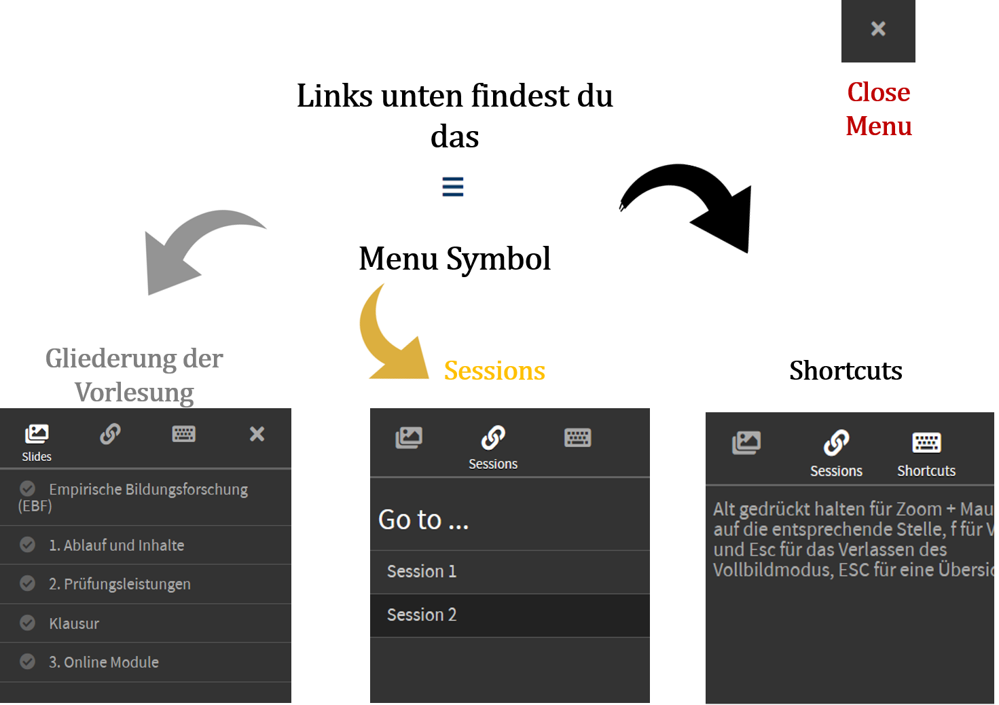

```{r setup, include=FALSE}
options(htmltools.dir.version = FALSE)

```

```{r best-features, echo=FALSE}
#search
#xaringanExtra::use_search(show_icon = TRUE, position = "top-right")

#xaringanExtra::style_search(#match_background = "black",
                            #input_background = "white",
                            #input_border = "black",
                            #match_current_background = "green")

xaringanExtra::use_tachyons()
xaringanExtra::use_tile_view()
xaringanExtra::use_webcam()

```


class: center, middle

# Vorlesung: Empirische Bildungsforschung
### Sitzung 1: Organisation und Ablauf


.large[Dr. Edgar Treischl] <br>
.large[Last update: `r Sys.Date()`]


<br>
<br>
<br>
<p align="left" style="font-size:75%;">This presentation is licensed under a CC-BY-NC 4.0 license.
You may copy, distribute, and use the slides in your own work, as long
as you give attribution to the original author on each slide that you use.
Commercial use of the contents of these slides is not allowed.</p>
<br>


---
# Inhalte der ersten Sitzung

## 1. Ablauf und Inhalte der Lehrveranstaltung
## 2. Prüfungsleistung
## 3. Digitale Lehre


---

# 1. Ablauf und Inhalte

## Ablauf

- Für jede Sitzung wird ein Online Modul zur Verfügung gestellt (StudOn).

- Online Module beinhalten Screencasts, Audio und weitere digitale Elemente.

- Module sind auch als PDF verfügbar.

- Für allgemeine Fragen findest Du auf Studon ein Forum.

## Ziel ist es ...

... sich im Laufe des Semesters mit Hilfe der Online Module in ausgewählte Themenblöcke der empirischen Bildungsforschung einzuarbeiten.


---


## Themenblock I: Grundlagen

1. Einführung und Formalia
2. Methoden Bootcamp
3. Zentrale Befunde der EBF
4. Theorien der EBF
5. Soziale Herkunft

## Themenblock II: Anwendungsgebiete

1. Evaluationsparadigma der EBF
2. Effekte der Klassengröße
3. Maßnahmen zur Reduktion sozialer Herkunftseffekte
4. Effekte von Studiengebühren


---
## Themenblock III: Klausur

1. EBF The Quiz
2. Und: FAQ Live Sitzung 
3. Klausur


## FAQ Live Sitzungen

- Zeit: Jeweils Montags um 15:00 Uhr
- Termine: 02.05; 30.05; 11.07
- Möglichkeit: Fragen zu den Inhalten stellen
- Sitzungen sind nicht verpflichtend, sondern als offene Sitzung geplant


---


# 2. Prüfungsleistungen

## Klausur

- **Multiple-Choice Klausur** (60 Minuten)
- Inhalt: Online Module und Vertiefungsliteratur
- **Termin**: 18.07.2022 um 15:00 Uhr
- Weitere Prüfungsmodalitäten werden auf StudOn veröffentlicht


---


## Klausurtipps:


````markdown
# Edgar ist kein Freund von auswendig lernen ...
# Stellt Euch lieber die Frage:
# Habe ich die zentralen Inhalte der LV verstanden?
# Kann ich Themen der LV anderen Studierenden erklären?
# Falls ja, seid ihr bestens für die Klausur gewappnet!
````


---
# 3. Online Module

## Ein paar technische Aspekte:
-  Die Folien sind für Windows und Mac erstellt und getestet (Firefox, Chrome und Safari). Mobile Endgeräte funktionieren nur bedingt (Apple I-Pad)
- Shortcuts
  - F: Full Mode
  - ESC: Return Full Mode and Overview 
- Interaktive Elemente auf den Folien: An machen Stellen wird es vertikale Slides geben, um Inhalte zu vertiefen. Die Pfeile links unten zeigen Dir welche Richtungen es gibt.
- Die Folien haben ein Menu


---
## The Menu 




---
class: center, middle


## Und im Laufe des Semester werden wir auf interaktive Elemente zurückgreifen damit dies kein reiner Lesekurs wird. Beispielsweise:


### - Interaktive Dashboards
### - Online Quizes


---
class: center, middle


## Beispielsquiz:

### Welche Aussage(n) stimmen?

**A.)** Jede Woche wird es ein Online Modul geben, die ich mir auch währrend der Klausur anschauen kann, ansonsten gibt es nichts zu tun.

**B.)** Fast jede Woche wird es ein Online Modul geben, dass ich nach Möglichkeit direkt bearbeiten sollte.

**C.)** Jede Woche wird es eine Übungsaufgabe geben, Angaben dazu erhalte ich per Flaschenpost.

**D.)** Im Laufe des Semesters sind 2 frei wählbare Studien zu lesen, diese werden mündlich abgefragt. 


---

## Fassen wir zusammen:

### 1. Am besten wöchentlich die Online Module bearbeiten
### 2. Bei Fragen zur Live Sitzung kommen
### 3. Bei sonstigen Fragen das Forum auf Studon benutzen, da andere Vorlesungsteilnehmer bestimmt ähnliche Fragen haben.
### 4. Stay healthy and keep in touch  &#128516;


